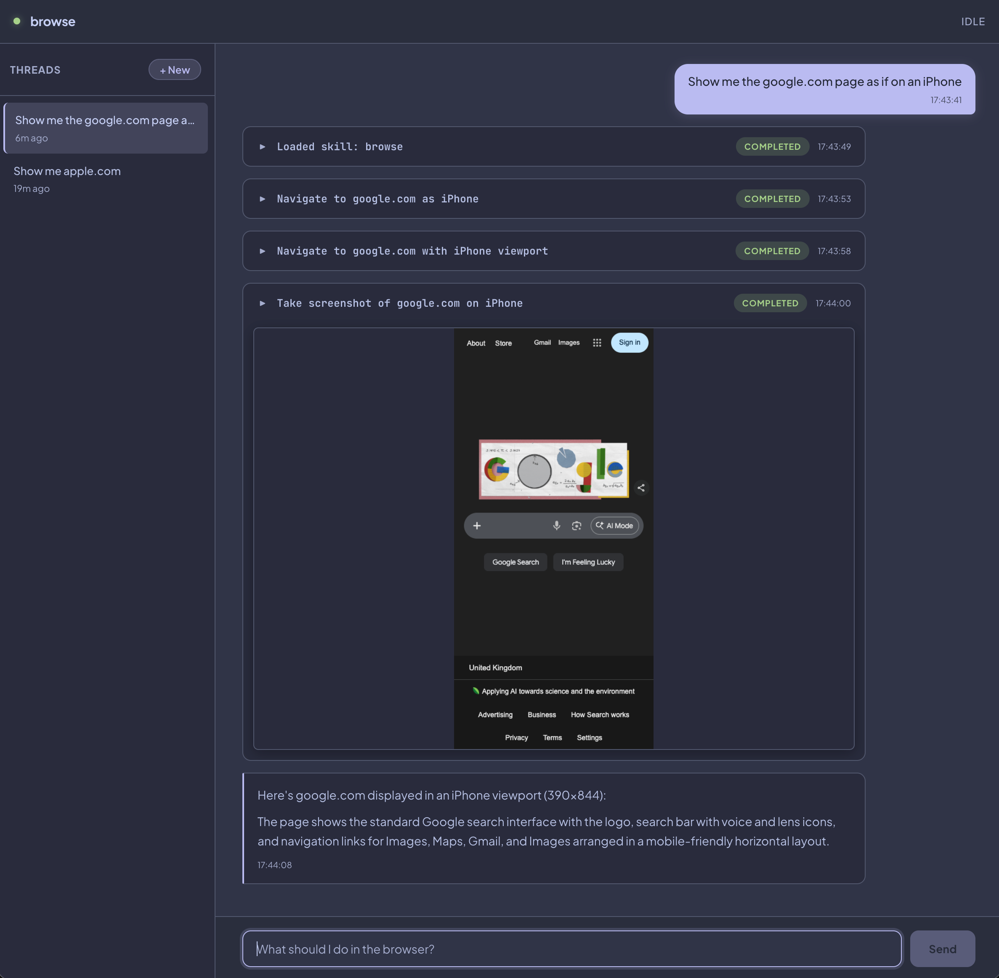

# browse-ui

A local web UI for browser automation driven by an OpenCode agent and the `browse` CLI.

You type a prompt, the agent runs real browser actions, and the app renders the work as a live timeline of user messages, agent text, tool calls, and screenshots.



## Current status

This repository is a working prototype, not a polished product.

What currently works:

- Bun server with a React frontend
- live event streaming over WebSocket
- persistent thread history in SQLite
- screenshot extraction and serving
- stop in-progress runs
- restart the `browse` daemon from the UI
- appearance settings and model selection via OpenCode config

What is still rough:

- setup is local-machine oriented
- error handling is minimal
- there is no auth or multi-user support
- persisted threads survive restarts, but agent session state is recreated as needed

## What the app does

1. You enter a natural-language browser task in the chat box.
2. The backend forwards that prompt to an OpenCode session.
3. OpenCode uses its configured instructions to call `browse` commands through tool use.
4. OpenCode streams events back to the Bun server.
5. The UI updates in real time with text output, tool cards, statuses, and screenshots.

Typical prompts:

- "Compare pricing for Vercel, Netlify, and Cloudflare Pages."
- "Open staging.example.com, log in, and test checkout."
- "Run through the signup flow and note accessibility issues."
- "Check the landing page on desktop and mobile."

## Architecture

The app is intentionally small:

- [index.ts](/Users/dan/Projects/browse-ui/index.ts:1): Bun server, REST API, WebSocket relay, screenshot serving, thread/session wiring
- [src/app.tsx](/Users/dan/Projects/browse-ui/src/app.tsx:1): React SPA, thread list, timeline, settings, chat input
- [src/opencode.ts](/Users/dan/Projects/browse-ui/src/opencode.ts:1): OpenCode SDK bootstrap, event subscription, session helpers
- [src/db.ts](/Users/dan/Projects/browse-ui/src/db.ts:1): SQLite persistence for threads and timeline entries

Runtime flow:

```text
UI -> Bun server -> OpenCode SDK -> opencode serve -> browse CLI/daemon -> browser
 ^         |
 |         -> WebSocket updates + screenshot serving
 -> REST APIs for threads, sessions, config, and providers
```

## Features in the current build

- Thread list with persisted history stored at `~/.browse-ui/browse.db`
- Auto-titles for new threads based on the first user message
- Live timeline with:
  - user messages
  - streaming markdown text
  - tool cards with status, input, output, and extracted screenshots
- Screenshot lightbox
- Session pre-warming so the first prompt starts faster
- Settings modal with:
  - font size
  - timestamp visibility
  - message width
  - auto-expand tool cards
  - model selection from available OpenCode providers

## Requirements

- [Bun](https://bun.sh)
- [`browse`](https://github.com/forjd/browse) installed and available on `PATH`
- [`opencode`](https://opencode.ai) installed and available on `PATH`
- at least one working OpenCode model/provider configuration
- the repo-local [SKILL.md](/Users/dan/Projects/browse-ui/SKILL.md:1) file

Optional override:

- set `BROWSE_UI_SKILL_PATH` if you want to point the app at a different instruction file for local testing

## Local development

```bash
bun install
bun run dev
```

Then open `http://localhost:3000`.

On startup the app:

- initializes the SQLite database in `~/.browse-ui`
- starts an OpenCode server through the SDK
- subscribes to OpenCode events
- pre-warms one session
- serves screenshots from `~/.bun-browse/screenshots`

## Testing

Focused tests:

```bash
bun test index.test.ts src/db.test.ts
```

This currently passes.

Plain `bun test` is misleading at the moment because Bun also discovers vendored tests under `opensrc/`, and some of those external fixtures are not runnable in this repo's test environment.

## Repo notes

- `opensrc/` is reference source code for dependencies, per `AGENTS.md`; it is not part of the runtime app
- [docs/mvp.md](/Users/dan/Projects/browse-ui/docs/mvp.md:1) is useful background, but it describes the original MVP plan rather than the exact current state
